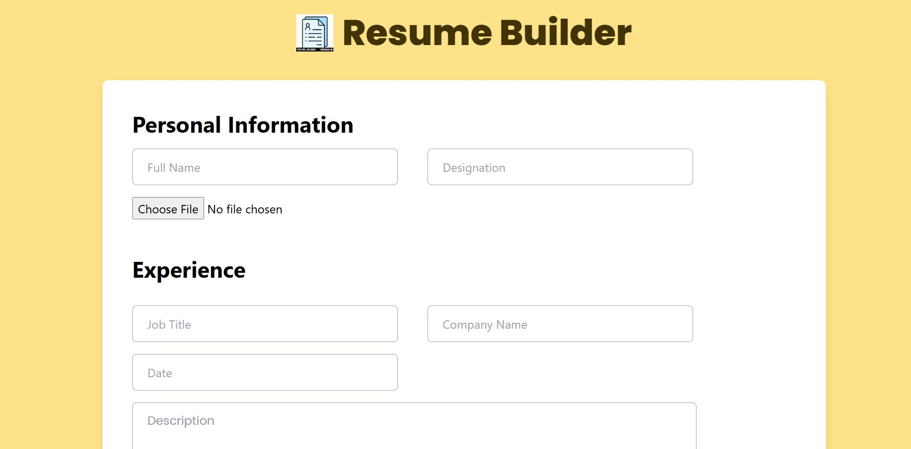
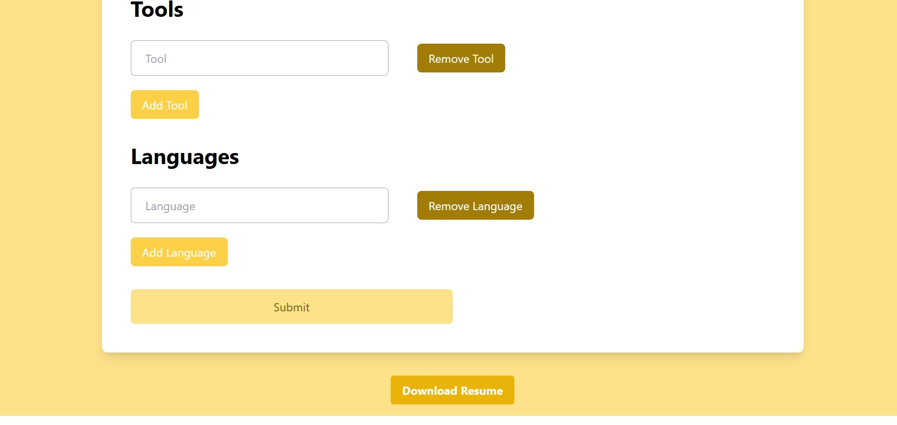
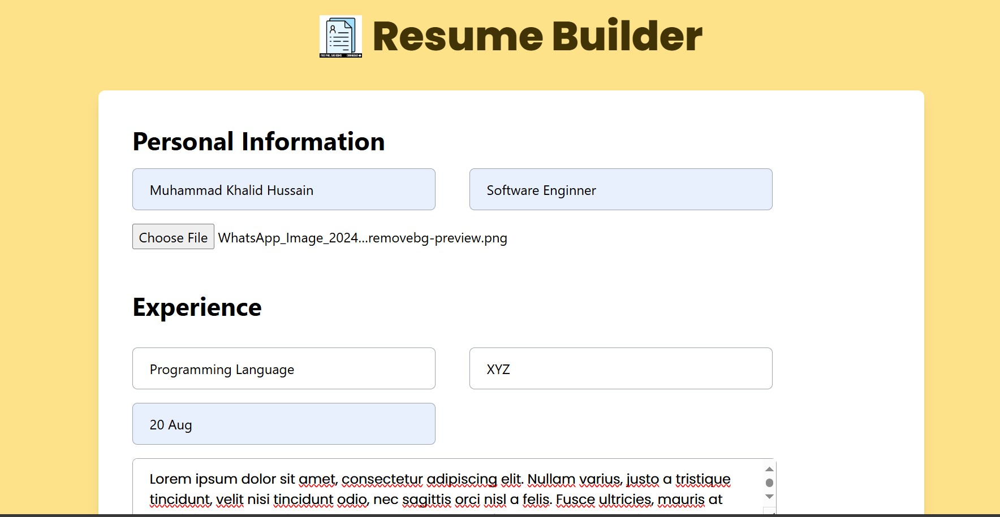
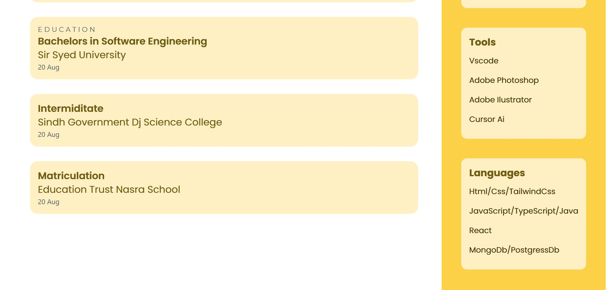
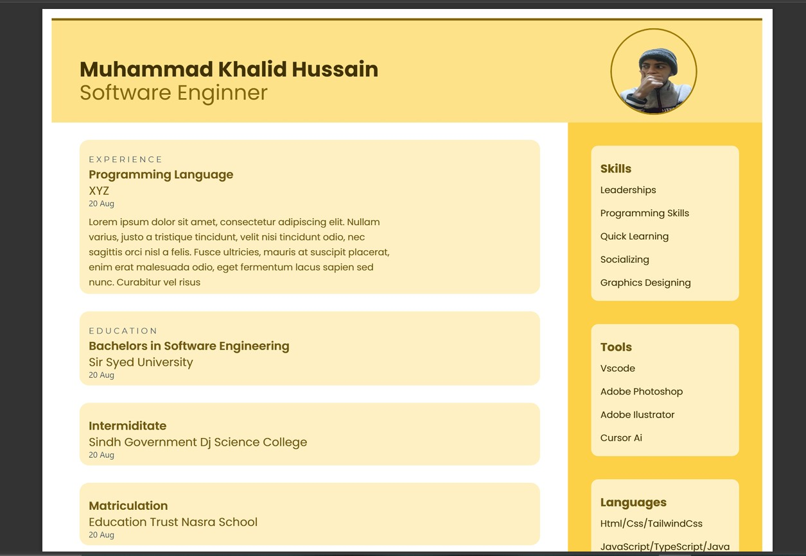

# ResumeBuilder

A **React-based Resume Builder** that allows users to **input their details, preview their resume, and download it as a PDF**. Built with **Formik for form handling, Tailwind CSS for styling, and Vite for fast performance**.

## 🚀 Features

✅ **User-Friendly Form** – Collects user details seamlessly using **Formik**.  
✅ **Live Resume Preview** – Instantly displays a formatted resume after submission.  
✅ **PDF Download** – Allows users to download their resume as a PDF.  
✅ **Responsive Design** – Built with **Tailwind CSS**, ensuring a great experience on all devices.  
✅ **Optimized Performance** – Powered by **Vite** for fast development and builds.

---

## 🛠 Technologies Used

- **React (Vite)** – Frontend framework
- **Formik** – Form handling and validation
- **Tailwind CSS** – Styling and responsive design
- **html2canvas & jsPDF** – Converts resume to PDF format

---

## 📂 Installation & Setup

1. **Clone the repository:**

   ```sh
   git clone https://github.com/mkhalidh/Resume_Builder.git
   cd Resume_Builder
   ```

2. **Install dependencies:**

   ```sh
   npm install
   ```

3. **Run the development server:**

   ```sh
   npm run dev
   ```

4. **Open in browser:**
   ```
   http://localhost:5173/
   ```

---

## 📌 How It Works

1. **Enter Details** – Users input their information in the form.
2. **Preview Resume** – The resume appears in real-time after submission.
3. **Download as PDF** – Users can click the **Download** button to save their resume.

---

## 🔮 Future Enhancements

📌 More resume templates to choose from.  
📌 Dark mode support.  
📌 Integration with online job platforms.

---

## 📜 License

This project is open-source and available under the **MIT License**.

---

### Happy Resume Building! 🚀

## Screenshots










